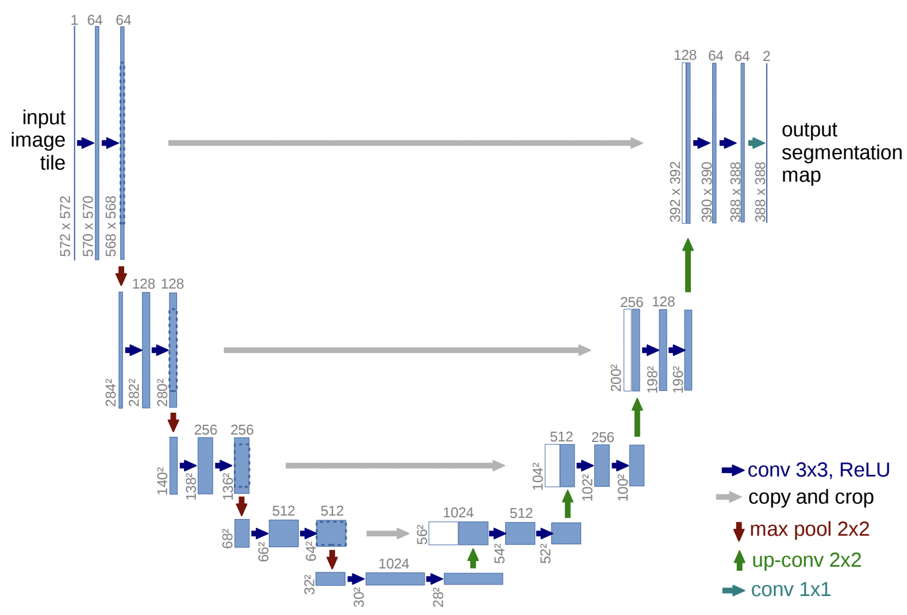

# Original U-Net

implementation Original U-Net.


<br><br><br>

## Prerequisites

```bash
$ make env                  # create anaconda environment
$ conda activate <new_env>  # activate anaconda environment
$ make setup                # initial setup for the project
```

## Check Model Input & Output

```bash
$ python src/check_model.py
```

## For Developers

```bash
$ make format   # format python scripts
$ make lint     # lint python scripts
```

## References

- https://github.com/4uiiurz1/pytorch-nested-unet/blob/master/archs.py
- https://arxiv.org/abs/1505.04597
- https://github.com/annotation-ai/python-project-template
